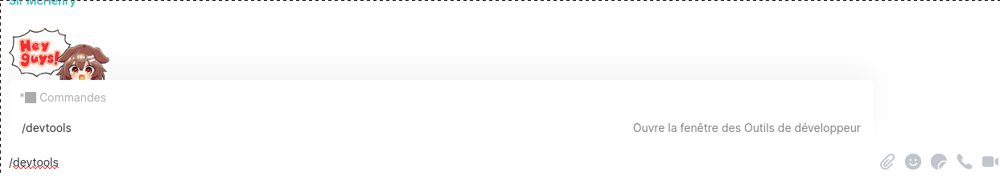
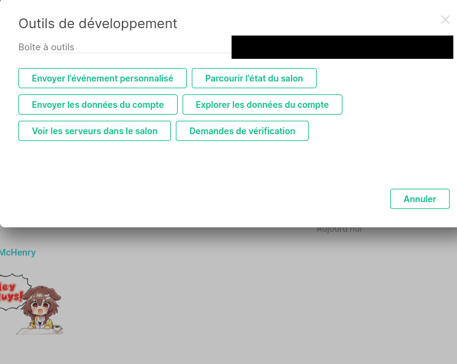

# Matrix Stickers
Matrix-stickers est un dépôt créé pour regrouper les pack de stickers créés par les IIEns.
Il propose aussi plusieurs tutoriels afin d'installer un meilleur "stickerpicker", d'utiliser des packs de sticker
ainsi que de les créer soi-même.
Salon d'aide : `##sticker:iiens.net`

**Table des matières**
- [Utiliser le stickerpicker d'un ami](#user-content-utiliser-le-stickerpicker-dun-ami)
- [Avoir un meilleur stickerpicker](#user-content-avoir-un-meilleur-stickerpicker)
- [Utiliser un pack de sticker du dépôt](#user-content-utiliser-un-pack-de-sticker)
- [Créer des packs de stickers](#user-content-créer-des-packs-de-stickers)
- [Utilisation de stpkg](#utilisation-de-stpkg)

## Utiliser le stickerpicker d'un ami
Si vous avez des amis ayant déjà leur propre stickerpicker, il est possible de le réutiliser.
Pour cela :
1. Demandez lui l'autorisation (ou non)
2. Récupérez l'adresse sur laquelle il héberge ses stickers. Cette adresse est de la forme :
  ```bash
  https://nom.iiens.net/stickerpicker/web/?theme=$theme
  ```
3. Connectez vous à Element. Utilisez la commande `/devtools`
4. Cliquer sur `Explorer les données du compte` puis sur `m.widgets`. Si absent : 1. Activer le gestionnaire d'intégration.
   `Tout les paramètres -> général -> Gérer les intégrations` 2. Envoyer n'importe quel sticker.
5. Cliquer sur `Modifier` et remplacer tout par le code suivant en n'oubliant pas de modifier
   les champs "url" et "sender":
```json
{
    "stickerpicker": {
        "content": {
            "type": "m.stickerpicker",
            "url": "https:///stickerpicker/web/?theme=$theme",
            "name": "Stickerpicker",
            "data": {}
        },
        "sender": "@:",
        "state_key": "stickerpicker",
        "type": "m.widget",
        "id": "stickerpicker"
    }
}
```
   Il faut remplacer les données entre `` par ce qu'il correspond à votre compte / installation.
6. Actualiser

## Avoir un meilleur stickerpicker
Le stickerpicker de base ne permet pas d'utiliser des stickers personnalisés.
Il faut donc installer notre propre stickerpicker qui pourra les utiliser.
Pour cela:
1. Se connecter à son perso ou son site web
  ```bash
  ssh nomArise@perso.iiens.net
  ```
2. Cloner ce dépôt.
  ```bash
  git clone https://git.iiens.net/Tigriz/matrix-stickers.git
  ```
3. Se déplacer dans le dépôt et exécuter le script `stpkg`
  ```bash
  cd matrix-stickers
  ./stpkg -install
  # ou pour une installation avec sshfs (cf "Utilisation de stpkg")
  ./stpkg -install -sshfs nomAAAA@perso.iiens.net -local ~/mnt/perso
  ```
4. Se connecter à Element. Utiliser la commande `/devtools` dans n'importe quel tchat.
   
5. Cliquer sur `Explorer les données du compte` puis sur `m.widgets`.
   - Si `m.widgets` est absent, il faut activer le gestionnaire d'intégration dans `Tout les paramètres -> Général -> Gerer les intégrations`.
     Ensuite il faut clicker sur `Envoyer` plutôt que `Modifier` dans le point suivant.
     
6. Cliquer sur `Modifier` (ou `Modifier`, cf point 5) et remplacer tout par le code suivant en n'oubliant pas de modifier
   les champs "url" et "sender" avec les infos correspondantes :
```json
{
    "stickerpicker": {
        "content": {
            "type": "m.stickerpicker",
            "url": "https:///stickerpicker/web/?theme=$theme",
            "name": "Stickerpicker",
            "data": {}
        },
        "sender": "@:",
        "state_key": "stickerpicker",
        "type": "m.widget",
        "id": "stickerpicker"
    }
}
```
   Il faut remplacer les données entre `` par ce qu'il correspond à votre compte / installation.

7. Actualiser Element
Vous avez maintenant un stickerpicker pouvant envoyer des stickers privacy\_pam.

## Utiliser un pack de sticker
Dans le dossier `pack` de ce dépôt sont regroupés tout les packs de sticker créé par des IIEns.
Pour les utiliser, vous devez déjà avoir installé votre propre stickerpicker (étape précédente).
Pour en ajouter un dans le stickerpicker, allez voir ce
[tutoriel](https://git.iiens.net/Tigriz/matrix-stickers/-/tree/master/packs).

## Créer des packs de stickers
Avec le nouveau stickerpicker installé, il est possible de créer ses propres packs de stickers.
Un pack de stickers se résume à un fichier json possédant des informations précises sur les images téléversées.
- Note 1  : Il est conseillé de créer un compte secondaire sur matrix.org pour créer les packs de stickers.
  Si vous utilisez votre compte Arise, il est possible que vos packs ne soient plus disponibles. En effet Arise
  libère de la place aléatoirement quand c'est nécessaire. Pour se créer un compte sur matrix.org, rendez vous
  [ici](https://app.element.io/#/register). Même si vos stickers sont hébergés sur votre compte secondaire, vous
  pourrez toujours utiliser le stickerpicker et envoyer les stickers avec votre compte Arise.
- Note 2 : Il est déconseillé d'effectuer cette étape sur perso.iiens.net. Préférez le faire sur votre machine car
  cette étape nécessite le paquet "ImageMagick" qui n'est pas à jour sur perso.iiens.net (impossible de le mettre à jour)
  et casse la transparence de vos images. Si vous souhaitez tout de même le faire sur perso.iiens.net, vous pouvez
  recompiler à la main le paquet, je vous laisse chercher comment faire.

Pour créer ce ficher json et téléverser ses images, il existe deux méthodes :

### Méthode automatique (Recommandé)
**Via stpkg**
**Requis** : *ImageMagick* (en tant que root : `apt install imagemagick`/`pacman -S imagemagick`).
Ce script suppose que vous avez déjà créer un ou plusieurs dossiers regroupant les images que vous souhaitez utiliser en sticker.
Le nom du dossier définira le nom du pack, et les images s'y trouvant deviendront les stickers du pack.
1. Cloner ce dépôt
  ```bash
  git clone https://git.iiens.net/Tigriz/matrix-stickers.git
  ```
2. Se connecter à Element et récupérer l'**access token** de son compte en allant dans
   `Tout les paramètres` -> `Aide & À propos` -> `Avancé`. Dans la dernière ligne `Jeton d'accès` cliquer pour l'afficher.
3. Utilisez la commande `stpkg pack`, vous devriez avoir `stpkg` dans votre path à ce moment
  ```bash
  # on détéctant le nom du pack
  read ACCESS_TOKEN # coller l'acces token puis faire "entrer"
  stpkg pack -t $ACCESS_TOKEN directory
  # ou en spécifiant le nom du pack
  read ACCESS_TOKEN
  stpkg pack -t $ACCESS_TOKEN name directory
  # ou sans stocker l'access token dans une variable de votre shell
  stpkg pack name directory # l'access token vous sera demandé, coller puis faire "entrer"
  ```
4. Vous pouvez activer le pack créé avec la commande `stpkg add <nom du pack>`.
- Note : Le dossier `directory` correpond au dossier contenant vos images à téléverser.
Le script `stpkg` va créer un dossier dans les packs du repo contenant trois fichiers :
    - nomdupack.json : le json des stickers téléversés, rognés, de taille 128x128, sans palette indexée (qui casse la transparence)
    - preview.png : une prévisualisation des images en mosaïque avec **ImageMagick**
    - README.md: Permet d'afficher les stickers du pack dans git

**Facultatif :** allez dans le dossier du repo des stickers, faites un commits et une merge request pour contribuer.
   Pensez à demander l'accès à un fork déjà existant plustôt que de créer
   le votre pour économiser de la place, les disques c'est pas gratuit.

**Tips**
```bash
git clone https://git.iiens.net/Tigriz/matrix-stickers
scp matrix-stickers/packs/*/*.json nom0000@perso.iiens.net:html/stickerpicker/web/packs
```

### Méthode manuelle
1. Téléverser une image dans un salon non-chiffré
    **Ne le faites pas sur le serveur Matrix d'Arise, les admins peuvent suppriment les images pour libérer de
    la place, mais ça n'a jamais été fait (source : Nitorac & Kubat)**. De manière générale pensez à compresser
    un peu vos images avant de les upload, les disques c'est pas gratuit.
2. Commencer votre fichier json de cette façon
```json
{
  "title": "",
  "id": "",
  "stickers": [
    ...
  ]
}
```
3. Cliquer sur les ... du message, `Voir source`, copier le code correspondant à celui ci-dessous et le coller entre les crochets du fichier json
    *Exemple*
    ```json
    {
      "body": "boom_ni.gif",
      "info": {
        "size": 3080290,
        "mimetype": "image/gif",
        "thumbnail_info": {
          "w": 498,
          "h": 498,
          "mimetype": "image/png",
          "size": 194660
        },
        "w": 498,
        "h": 498,
        "thumbnail_url": "mxc://tedomum.net/LyJmspAoLIOBPHUzqwwEBzmH"
      },
      "msgtype": "m.image",
      "url": "mxc://tedomum.net/LSJhWayzyrbIkntHxnThICKQ"
    }
    ```
    **Attention** : ajouter `"id" : "Ce que vous voulez"` après le champ `url`. Il est important de ne pas l'oublier sinon les stickers de s'enverront pas.
4. Répéter jusqu'à avoir tous les stickers voulu dans le pack
5. Ajouter le json à index.json

## Utilisation de stpkg
La commande `stpkg` a besoin des executables `egrep` (ou `grep` si indisponible),
`sponge` et `jq`. Il faut donc les installer ou les recompiler sur votre machine
(`apt install moreutils jq grep`).

### Utilisation basique
Après avoir utilisé `stpkg -install`, vous pouvez placer le script `stpkg`
dans votre path ou créer un alias pour l'exécuter facilement.

Les commandes de `stpkg` :
- `stpkg -install [-sshfs user@server -local mnt_local] [folder]`
- `stpkg update`
- `stpkg list [-e -p -np] [regex bash]`
- `stpkg add <pack>`
- `stpkg del <pack>`
- `stpkg pack [-t token] [name] <folder>`

> Au moment de l'installation `stpkg` a créé un fichier `~/.config/stpkg.sh`
  qui sera sourcé à chaque lancement de `stpkg`. Il contient les variables
  utilisées, vous pouvez les modifier selon vos envies.

### Comment utiliser stpkg sur perso

**TL;DR** sshfs à la rescousse.

**Les vrais explications :** au moment de l'installation de `stpkg` on va
utiliser les options `-sshfs <ssh address> -local <point de montage locale>`.
Veillez noter que si vous utilisez l'option `-sshfs`, l'option `folder`
pointera sur un dossier *sur perso*.

Voici un exemple d'installation avec sshfs, où votre repo est sur votre ordi et
les stickers sur perso :
```bash
./stpkg -install -sshfs nomAAAA@perso.iiens.net -local ~/mnt/perso
```
